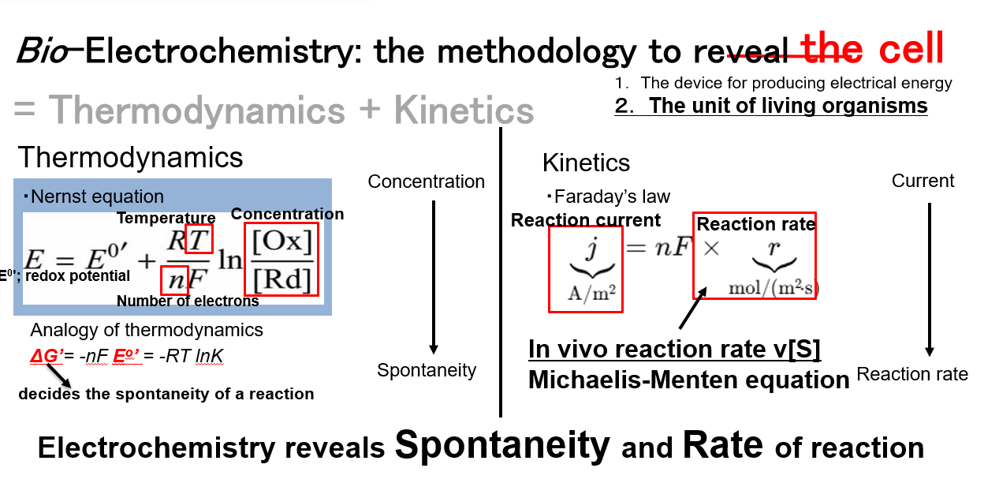
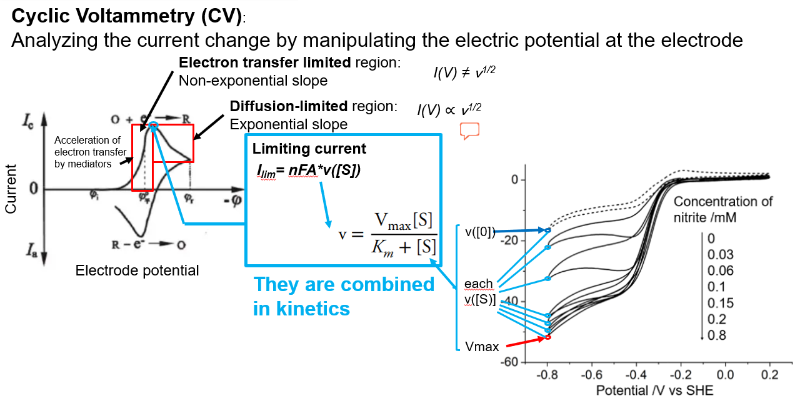

# Bio-Electrochemical Data Analysis

## はじめに

Bio-electrochemistyは、微生物または酵素が触媒となる電子移動反応を研究する分野です。ここでは微生物電気化学の概念から実際の応用事例そして解析方法について紹介します。

## 微生物電気化学の概念

## 電気化学測定法の基礎

### 1. クロノアンペロメトリー (Chronoamperometry, CA)

クロノアンペロメトリーは、作用電極に一定の電位ステップを印加し、時間に対する電流の変化を測定する手法です。電位ステップが印加されると電極表面で反応が起こり、時間とともに拡散層が成長するため電流は減少していきます。

拡散律速の反応では、電流-時間応答は**Cottrellの式**で記述されます：

$$I(t) = \frac{nFAC_0\sqrt{D}}{\sqrt{\pi t}}$$

この式は電流が時間の平方根の逆数に比例することを示し、拡散係数や反応種濃度の決定に利用されます。

**データの読み方：** 時間経過とともに電流が減少する曲線として観測され、初期の急激な電流減少から徐々に安定した減少パターンに移行します。

### 2. サイクリックボルタンメトリー (Cyclic Voltammetry, CV)

サイクリックボルタンメトリーは、電位を連続的に掃引し電流を測定する手法で、反応物質または触媒美微生物の酸化還元電位を求めることができます。さらに得られる電流-電位曲線から、反応の可逆性や電子数、反応機構に関する情報が得られます。特に微生物を触媒とする反応を計測する際は、より詳細な速度論モデル（e.g. Michaelis-Menten式）と結合し、速度論を考察することができます。

図にあるように、拡散律速となる場合の電流値は速度vの平方根に比例します。表面反応律速となる場合（十分に電子移動が加速されている場合）の電流値は速度vに比例します。

また可逆反応のピーク電流は**Randles-Sevcikの式**で表されます：

$$I_p = (2.69 \times 10^5) n^{3/2} A D^{1/2} C_0 v^{1/2}$$

## 本スクリプトの目的と機能
Opentrons OT-2による実験操作の自動化プロトコルを提示してありますのでご覧ください。実際の実験用のpythonスクリプトは準備中です。

### 主要機能
データ読み込みと前処理、平均化処理、可視化、ファイル保存